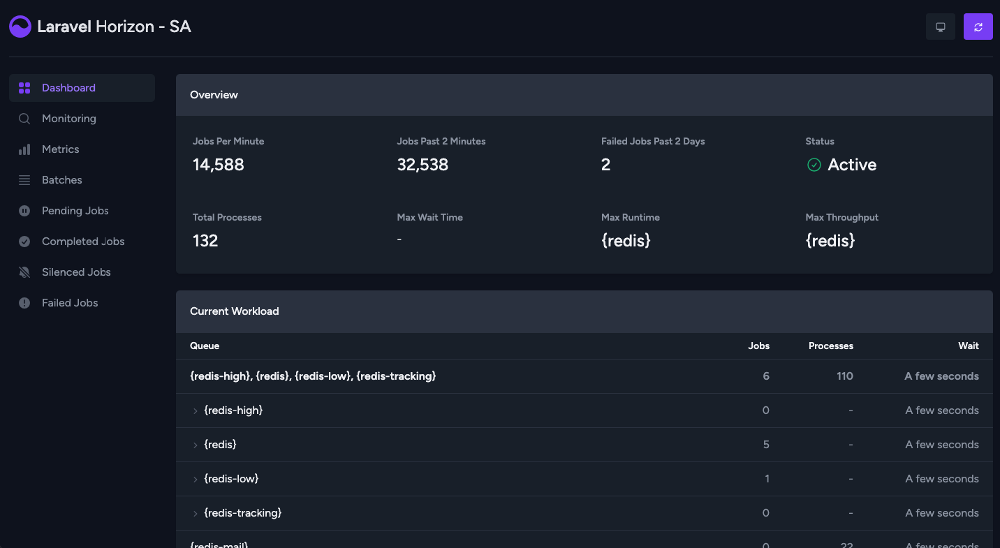

# Laravel Horizon - Cluster Support

This package should support a laravel horizon thru a redis-cluster, it should also support an AWS Elastic Load Balancer.

## Installation

```bash
composer require daison/laravel-horizon-cluster
```

After installing this package, now publish the assets using `horizon:install`

```bash
php artisan horizon:install
```

### Remove the auto discover

Modify your original laravel's `composer.json` and add this

```json
{
    "extra": {
        "laravel": {
            "dont-discover": [
                "laravel/horizon"
            ]
        }
    }
}
```

### Use the modified horizon

Modify your `config/app.php`

```php
return [
    'providers' => [
        // ...

        Daison\LaravelHorizonCluster\AppServiceProvider::class,
        App\Providers\HorizonServiceProvider::class,
    ],
];
```

## config/database.php

Usually your laravel `config/database.php` should look like this.

```php
return [
    'redis' => [
        'client' => 'predis',

        'clusters' => [
            'default' => [
                [
                    'host'     => env('REDIS_HOST', '127.0.0.1'),
                    'port'     => env('REDIS_PORT', '6379'),
                    'password' => env('REDIS_PASSWORD', null),
                    'database' => 0,
                ],
            ],
            // ...
        ],

        'options' => [
            'cluster' => 'redis',
        ],
    ],
];
```

## config/horizon.php

Make sure your horizon will have this kind of config or similar.

```php
return [
    'use' => 'clusters.default',

    // ...

    'defaults' => [
        'worker' => [
            'connection' => 'redis',
            'balance'    => env('HORIZON_QUEUE_WORKER_BALANCE', false),
            'timeout'    => env('HORIZON_QUEUE_WORKER_TIMEOUT', 10),
            'sleep'      => env('HORIZON_QUEUE_WORKER_SLEEP', 3),
            'maxTries'   => env('HORIZON_QUEUE_WORKER_MAXTRIES', 3),
        ],
    ],

    'environments' => [
        env('APP_ENV') => [
            'worker' => [
                'connection' => 'redis',
                'queue'      => [
                    '{redis-high}',
                    '{redis}',
                    '{redis-low}',
                ],
                'memory'       => env('HORIZON_QUEUE_WORKER_MEMORY', 128),
                'minProcesses' => env('HORIZON_QUEUE_WORKER_MIN_PROCESSES', 1),
                'maxProcesses' => env('HORIZON_QUEUE_WORKER_MAX_PROCESSES', 3),
            ],
        ],
    ],
];
```
